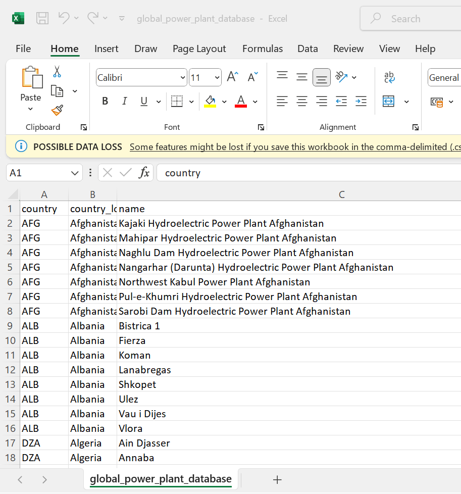

# Global power plant database
A dataeset of ***powerplants*** around the world.
## Includes
-location
-name of powerplant
-owners
## Type
-a csv file
## First ReadMe
This is my first ReadMe
## Screenshot

